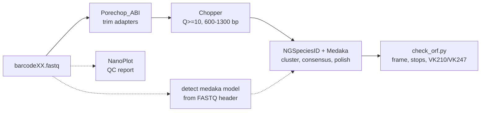

# nf-pvcsp

Reference-free consensus sequences of the *Plasmodium vivax* circumsporozoite protein gene (**PvCSP**) from Oxford Nanopore amplicon reads, as a [Nextflow](https://www.nextflow.io/) pipeline.

For each barcode (one sample = one ~1 kb PvCSP amplicon library) the pipeline returns **one polished consensus per haplotype** (for example a VK210 + VK247 mixed infection gives two), the number of reads behind each, and an automatic check that the central repeat is in frame with no premature stop codons.



## Why not just run NGSpeciesID with its defaults?

The PvCSP central repeat is a tandem array of 9-amino-acid units (VK210: `GDRA(D/A)GQPA`, VK247: `ANGA(G/D)(N/D/G)QPG`), which makes default NGSpeciesID output unreliable in two ways. This pipeline corrects both:

| Problem with defaults | What this pipeline does |
|---|---|
| **Frameshifts / premature stops in the repeat.** NGSpeciesID calls `spoa` with hardcoded local-alignment settings that let repeat units slip against each other. | `bin/spoa` is a small wrapper that Nextflow puts first on `PATH`; it replaces those settings with semi-global alignment and gap penalties of -8 / -6. NGSpeciesID itself is not modified. |
| **Minor haplotypes silently lost.** Forward and reverse-strand reads of one haplotype form separate clusters, and the abundance filter is applied before they are merged, so each half can fall under the cutoff. | Uses all reads (`--sample_size 0`), a lower cutoff (`--abundance_ratio 0.02`), and writes `*_cluster_sizes.tsv` so you can see clusters that narrowly missed it. |

## Requirements

* [Nextflow](https://www.nextflow.io/) >= 26.04 (developed and tested with 26.04.6)
* [conda](https://docs.conda.io/) or [mamba](https://mamba.readthedocs.io/) (the tools are installed automatically from `envs/*.yml` on the first run; this takes several minutes and a few GB of disk)
* Reads basecalled with **Dorado** (R10.4.1). The Medaka model is read from the `RG:Z:` tag in the FASTQ header. If your reads have no such tag, pass `--medaka_model` yourself.

Installing Nextflow with conda:

```bash
conda create -n nextflow -c bioconda nextflow -y
conda activate nextflow
nextflow -version
```

## Quick start

1. Make a samplesheet (see [`assets/samplesheet_example.csv`](assets/samplesheet_example.csv)); use **absolute** paths:

   ```csv
   barcode_id,fastq
   barcode01,/data/run1/barcode01.fastq
   barcode02,/data/run1/barcode02.fastq
   ```

2. Run:

   ```bash
   conda activate nextflow
   nextflow run <your-github-username>/nf-pvcsp -r v0.1.0 \
       --samplesheet samplesheet.csv \
       --outdir results
   ```

   or, from a local clone: `nextflow run /path/to/nf-pvcsp --samplesheet samplesheet.csv`

3. If a run stops (crash, closed laptop), repeat the same command with `-resume` to continue from the last finished step.

### Helper script (optional)

`run_pvcsp.sh` builds the samplesheet for you. Run it from the folder that holds your FASTQ files; give barcode names **without** `.fastq`:

```bash
cd /data/run1
/path/to/nf-pvcsp/run_pvcsp.sh barcode07 barcode08 barcode09
```

Options: `-d` FASTQ folder, `-o` output folder, `-c` max CPUs, `-n` dry run (checks everything, runs nothing).

## Parameters

Set on the command line as `--name value`.

| Parameter | Default | Meaning |
|---|---|---|
| `--samplesheet` | *(required)* | CSV with columns `barcode_id,fastq` |
| `--outdir` | `results` | Output folder |
| `--min_quality` | `10` | Chopper minimum read Q-score |
| `--min_length` / `--max_length` | `600` / `1300` | Chopper length window. Kept wide on purpose so repeat-length variants are not discarded |
| `--abundance_ratio` | `0.02` | NGSpeciesID keeps clusters holding at least this fraction of filtered reads |
| `--max_seqs_for_consensus` | `500` | Reads per cluster used to build the consensus |
| `--mapped_threshold` / `--aligned_threshold` | `0.80` / `0.50` | NGSpeciesID clustering thresholds (run with `--symmetric_map_align_thresholds`) |
| `--medaka_model` | *auto* | Medaka model, e.g. `r1041_e82_400bps_hac_v5.2.0`. Auto-detected from the FASTQ header when not set |
| `--max_cpus` | all cores | Upper limit on CPUs. NGSpeciesID/Medaka uses up to 8, so on a small machine barcodes go through that step one at a time |
| `--ngs_env` / `--ngsid_env` | `envs/*.yml` | Conda environment for the QC/filtering steps and for NGSpeciesID. Give the path of an existing environment to reuse it, e.g. `--ngsid_env ~/miniconda3/envs/ngsid` |

## Output

Everything for a barcode is in `results/<barcode_id>/`:

| File | Content |
|---|---|
| `<barcode>_consensus_cluster1.fasta`, `..._cluster2.fasta`, ... | One polished consensus per haplotype. `cluster1` is the one with the most reads. The header lists the reads behind it |
| `<barcode>_cluster_read_counts.tsv` | Reads per consensus: `cluster`, `ngspeciesid_cl_id`, `reads`, `pct_of_filtered_reads` |
| `<barcode>_cluster_sizes.tsv` | **All** clusters found, including small ones that did not get a consensus. Use it to spot a low-frequency haplotype just under the cutoff |
| `<barcode>_check_orf.tsv` | ORF check of each consensus (below) |
| `nanoplot/` | NanoPlot QC of the raw reads: interactive `NanoPlot-report.html` (read-length histogram etc.) and `NanoStats.txt`. Static PNGs are switched off (`--no_static`) because they need a working kaleido/Chrome setup |

Run reports are in `results/pipeline_info/` (`report.html`, `timeline.html`, `trace.tsv`).

### Reading `check_orf.tsv`

`check_orf.py` finds the conserved peptide `RENKLKQP` just upstream of the central repeat, translates from there (both strands, all frames) and reports:

| Column | Meaning |
|---|---|
| `strand`, `frame` | Where the coding sequence was found. The consensus can be the reverse complement; it is not re-oriented |
| `post_aa` | Amino acids from the anchor to the end |
| `stops` | Internal stop codons. **Must be 0**; a stop within the last 6 residues is treated as the natural end |
| `rep_units` | Repeat type and number of intact units, e.g. `VK210x18` |
| `verdict` | `OK` (no internal stop) or `FAIL` |

* A **VK210 + VK247 mixture** shows as two consensus sequences with different `rep_units` types.
* `FAIL` means the repeat is not trustworthy: do not use that consensus. Check coverage and the basecalling model.
* `NO ANCHOR FOUND` means the sequence is not PvCSP or the anchor region is damaged.
* Treat consensus sequences with very few reads with caution; they can be artifacts.

## Troubleshooting

| Message / symptom | Cause and fix |
|---|---|
| `Missing --samplesheet` | Pass `--samplesheet your.csv` |
| `cannot derive medaka model from first header` | Reads have no Dorado `RG:Z:` tag. Use `--medaka_model <model>` (list: `medaka tools list_models`) |
| `spoa wrapper is not first on PATH` | Something is overriding `PATH` inside the task. The wrapper in `bin/spoa` must run instead of the conda `spoa` |
| `no consensus produced ... (no cluster passed --abundance_ratio?)` | Too few reads, or no cluster reaches the cutoff. Look at the cluster sizes, then try a lower `--abundance_ratio` |
| Minor haplotype missing | Check `*_cluster_sizes.tsv`; if it is there but under the cutoff, lower `--abundance_ratio` (e.g. `0.01`) |
| Task fails with too many CPUs requested | Lower `--max_cpus` to what your machine has |

## Limitations

* Developed and validated on six barcodes from a single R10.4.1 flow cell, basecalled with Dorado `hac@v5.2.0`. Other chemistries or basecallers have not been tested.
* Only tested on macOS. Linux should work but has not been tried.
* Software is managed with conda only (no Docker/Singularity profile yet).
* The `spoa` wrapper is written for NGSpeciesID 0.3.1 with spoa 4.1.5 (pinned in `envs/ngsid.yml`). Other versions may call `spoa` differently.
* The ORF check is specific to PvCSP (anchor `RENKLKQP`, VK210 and VK247 repeat motifs). Using the pipeline for another amplicon requires editing `bin/check_orf.py`.

## Repository layout

```
main.nf              workflow
nextflow.config      parameters and resources
modules/             one file per pipeline step
bin/                 spoa wrapper, check_orf.py, helper scripts
envs/                conda environments (pinned versions)
assets/              example samplesheet
run_pvcsp.sh         optional launcher
```

## Credits and citation

This pipeline only wraps existing tools; please cite the original software when you use it:
[NGSpeciesID](https://github.com/ksahlin/NGSpeciesID), [Medaka](https://github.com/nanoporetech/medaka), [spoa](https://github.com/rvaser/spoa), [Porechop_ABI](https://github.com/bonsai-team/Porechop_ABI), [Chopper](https://github.com/wdecoster/chopper), [NanoPlot](https://github.com/wdecoster/NanoPlot) and [Nextflow](https://www.nextflow.io/).

Author: Parsakorn Tapaopong. Licensed under the [MIT License](LICENSE).
